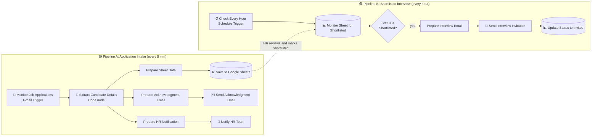
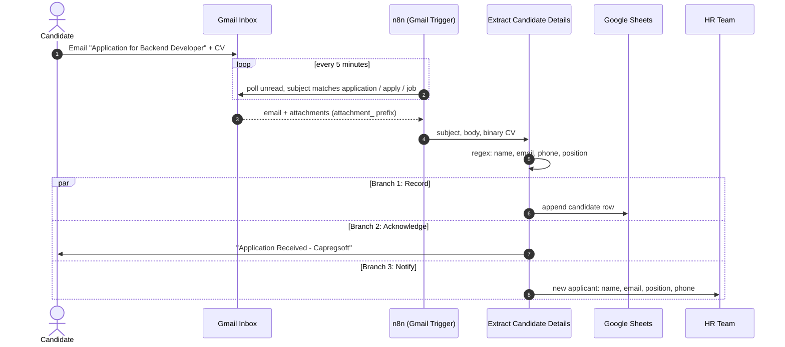
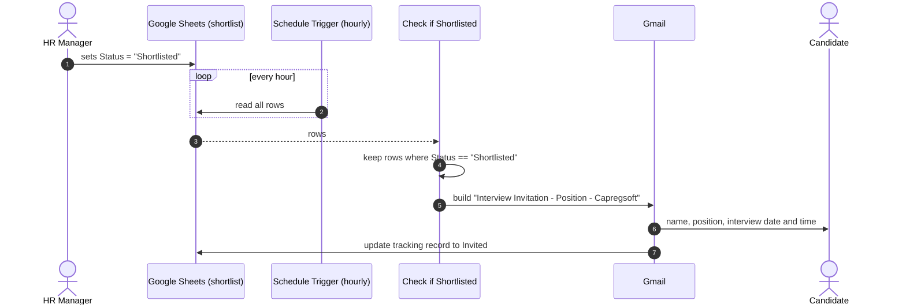
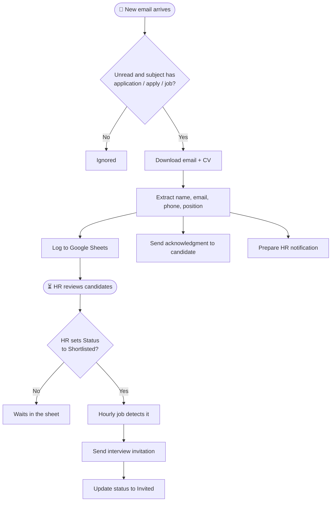
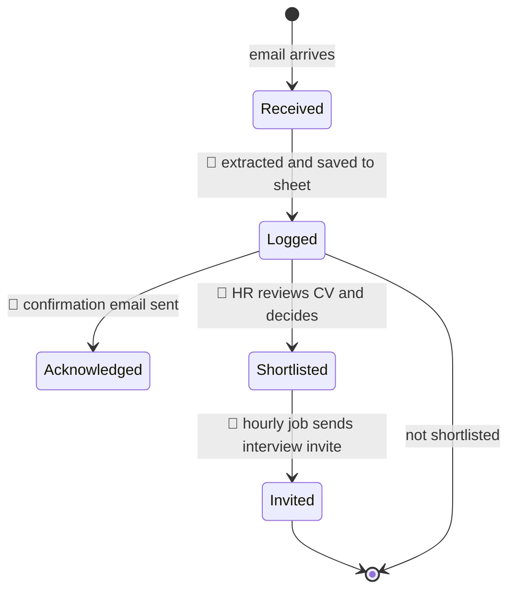

<div align="center">

# 🧑‍💼 Capregsoft HR: Job Application Processing & Candidate Screening Automation

**Applications land in Gmail. Candidates are logged, acknowledged and, once shortlisted, invited to interview. Automatically.**


</div>

---

## 📝 Short Description

An n8n automation that runs the first stage of hiring end to end. It watches a Gmail inbox for job applications, extracts each candidate's name, email, phone, applied position and CV attachment, logs the details to Google Sheets, sends the applicant an instant acknowledgment, and prepares an HR alert. A separate hourly job watches a shortlist sheet and, once HR marks a candidate Shortlisted, emails an interview invitation and records the status change. HR stops copying details by hand, applicants get fast replies, and no application is forgotten in the inbox. Simple, transparent, and easy to extend with AI screening.

---

## 📑 Table of Contents

1. [The Big Problem This Solves](#-the-big-problem-this-solves)
2. [What It Does (At a Glance)](#-what-it-does-at-a-glance)
3. [Tech Stack](#-tech-stack)
4. [System Architecture](#-system-architecture)
5. [The Full Automation, Stage by Stage](#-the-full-automation-stage-by-stage)
6. [End-to-End Sequence Diagrams](#-end-to-end-sequence-diagrams)
7. [Candidate Lifecycle](#-candidate-lifecycle)
8. [The Extraction Engine](#-the-extraction-engine)
9. [Google Sheets Data Model](#-google-sheets-data-model)
10. [Setup Guide](#-setup-guide)
11. [Production-Readiness Checklist](#-production-readiness-checklist)
12. [Roadmap](#-roadmap)
13. [Full Automation in One Minute](#-full-automation-in-one-minute)
14. [Author](#-author)

---

## 🔥 The Big Problem This Solves

Every open position at a company produces the same messy pile: a stream of application emails, each written differently, each with a CV attached, all mixed into a shared inbox. Someone in HR then has to:

- notice that a new application arrived
- open it and work out *who* applied, for *which role*, with *what contact details*
- copy all of that into a tracking sheet by hand
- write back to the candidate so they know it was received
- tell the rest of the HR team a new candidate is waiting
- later, remember which candidates were shortlisted and email each one an interview invite

That manual loop is **slow, repetitive and easy to get wrong**. Applications sit unread, details get mistyped, candidates hear nothing for days, and shortlisted people are invited late or not at all.

### ✅ What this project fixes

| Pain point (before) | Solution (after) |
|---|---|
| Applications buried in a shared inbox | Gmail is polled every 5 minutes and matching emails are picked up automatically |
| Candidate details copied by hand | A parser extracts name, email, phone and position from the email |
| CVs scattered as attachments | Attachments are downloaded with the email and carried through the workflow |
| Applicants left waiting with no reply | An acknowledgment email goes out right away |
| HR unaware of new applicants | An HR notification is prepared for every new application |
| Shortlisted candidates forgotten | A scheduled job checks the shortlist sheet every hour and sends interview invitations |
| No record of progress | Google Sheets acts as the tracker, and the status is updated after the invitation |

> **In one line:** it turns *unstructured application emails* into *structured candidate records with instant replies and automated interview invitations*.

---

## ⚡ What It Does (At a Glance)

- 📥 **Watches Gmail** for unread emails whose subject contains *application*, *apply* or *job*, every 5 minutes, with attachments downloaded.
- 🔎 **Extracts** candidate name, email, phone number, applied position and the CV attachment.
- 🌿 **Fans out into three parallel branches** from one extraction step: log to sheet, acknowledge the applicant, notify HR.
- 📊 **Logs** the candidate in Google Sheets.
- ✉️ **Acknowledges** every applicant with a professional confirmation email.
- ⏱ **Runs a second, independent pipeline every hour** that reads the shortlist sheet.
- 🎯 **Filters** rows whose `Status` is `Shortlisted`.
- 📅 **Sends an interview invitation** with position, date and time, then updates the tracking sheet.

**Workflow footprint:** 14 nodes: 2 triggers (Gmail, Schedule), 1 Code node, 4 Set nodes, 3 Google Sheets nodes, 3 Gmail nodes and 1 IF node. There is no AI model in this version; the design keeps it deterministic and cheap, with AI screening as a natural next step.

---

## 🧰 Tech Stack

| Layer | Technology | Role |
|---|---|---|
| Orchestration | **n8n** | Workflow engine for both pipelines |
| Intake | **Gmail Trigger** (poll every 5 min, unread, subject filter, attachments on) | Captures new applications |
| Parsing | **JavaScript (n8n Code node)** with regular expressions | Extracts structured fields from free text |
| Data store | **Google Sheets** | Candidate tracker and shortlist board |
| Outbound mail | **Gmail nodes** | Acknowledgment, HR notification and interview invitation |
| Scheduling | **Schedule Trigger** (hourly) | Drives the shortlist-to-interview pipeline |

---

## 🏗 System Architecture

The workflow contains **two independent pipelines** that share Google Sheets as their meeting point.



The dotted line is the **human-in-the-loop moment**: HR reviews the logged candidates and marks the good ones `Shortlisted`. Everything before and after that decision is automated.

---

## 🔬 The Full Automation, Stage by Stage

### 🟢 Pipeline A: Application Intake

**Stage 1: Capture (Monitor Job Applications)**

- Gmail Trigger polls **every 5 minutes**.
- Filter query: `subject:(application OR apply OR job)`, **unread only**.
- **Attachments are downloaded** and exposed with the prefix `attachment_`, so the CV travels with the email.
- Full (non-simplified) email data is requested, so both subject and body are available for parsing.

**Stage 2: Extract (Extract Candidate Details)**

A JavaScript Code node (run once per email) turns free text into structured data:

- 👤 **Name**: found via labels like `Name:` / `Applicant:` / `Candidate:` in the body, or `Application from …` in the subject.
- 📧 **Email**: the first email-shaped string in the body.
- 📞 **Phone**: found via labels like `Phone:` / `Mobile:` / `Contact:` / `Tel:`, with a fallback pattern for international formats.
- 💼 **Position**: read from subject patterns like `Application for …` / `Applying for …`, or from the body (`Position:`, `Role:`, `Job:`).
- 📎 **CV**: the binary attachment object.
- Everything else (raw body and subject) is preserved for later use.
- Every field falls back to an **empty string** instead of crashing, so a badly formatted email never stops the pipeline.

**Stage 3: Fan-out into three parallel branches**

The single extraction node feeds three branches at once:

- **Branch 1, Record:** `Prepare Sheet Data` → `Save to Google Sheets` appends the candidate to the tracker.
- **Branch 2, Acknowledge:** `Prepare Acknowledgment Email` builds `toEmail`, `subject` (*Application Received - Capregsoft*) and `candidateName`, then `Send Acknowledgment Email` sends the confirmation.
  - *"Dear {name}, thank you for applying to Capregsoft. We have received your application and our HR team will review it carefully. If your profile matches our requirements, we will contact you to schedule an interview."*
- **Branch 3, Notify HR:** `Prepare HR Notification` packages `candidateName`, `candidateEmail`, `position` and `candidatePhone`, then `Notify HR Team` delivers the alert.

Because the branches are parallel, a hiccup in one (say, the Sheets API) does not have to block the applicant's acknowledgment.

### 🟣 Pipeline B: Shortlist to Interview

**Stage 4: Schedule (Check Every Hour)**

- A Schedule Trigger fires **once every hour**, independent of Pipeline A.

**Stage 5: Read the shortlist (Monitor Sheet for Shortlisted)**

- Reads the rows of the shortlist board in Google Sheets. This is where HR sets the `Status` column.

**Stage 6: Filter (Check if Shortlisted)**

- An IF node passes only rows where `Status` equals `Shortlisted` (case-sensitive).

**Stage 7: Compose (Prepare Interview Email)**

- Prepares the fields the email needs: `candidateName`, `candidateEmail`, `position`, `interviewDate`, `interviewTime`.

**Stage 8: Invite (Send Interview Invitation)**

- Sends a personalised email, subject `Interview Invitation - {position} - Capregsoft`:
  - *"Congratulations! Your application for the position of {position} has been shortlisted. Interview Date: … Interview Time: … Please confirm your availability by replying to this email."*

**Stage 9: Close the loop (Update Status to Invited)**

- Writes back to Google Sheets so the candidate is tracked as *Invited*.

---

## 🎞 End-to-End Sequence Diagrams

### 1️⃣ Pipeline A: From Application Email to Logged Candidate



### 2️⃣ Pipeline B: Shortlisted Candidate to Interview Invitation



### 3️⃣ Master Decision Flow



---

## 🔄 Candidate Lifecycle

A candidate moves through these states. Automation handles the transitions marked 🤖, and HR owns the one marked 👤.



---

## 🔎 The Extraction Engine

Applicants don't follow a template, so the Code node uses **layered fallbacks**: try the most reliable pattern first, then a looser one, then give up gracefully with an empty string.

| Field | Primary pattern | Fallback |
|---|---|---|
| **Name** | Body label: `Name` / `Applicant` / `Candidate` followed by a capitalised multi-word name | Subject: `Application from …` / `From …` |
| **Email** | First email-shaped string in the body | none (empty string) |
| **Phone** | Body label: `Phone` / `Mobile` / `Contact` / `Tel` followed by 10 to 20 digit-like characters | General international phone shape (country code, area code, number) |
| **Position** | Subject: `Application for` / `Applying for` / `Position:` / `Job:` up to a dash | Body: `Position` / `Role` / `Job` `applied for` … |
| **CV** | Binary attachment object from the Gmail node | empty object |

**Example input**

```
Subject: Application for Frontend Developer - Ali Raza

Name: Ali Raza
Email: ali.raza@example.com
Phone: +92 300 1234567
Please find my CV attached.
```

**Extracted output**

```json
{
  "candidateName": "Ali Raza",
  "candidateEmail": "ali.raza@example.com",
  "candidatePhone": "+92 300 1234567",
  "position": "Frontend Developer",
  "cvAttachment": { "attachment_0": "…binary…" }
}
```

---

## 🗄 Google Sheets Data Model

The workflow uses two spreadsheets: a **tracker** that Pipeline A writes to, and a **shortlist board** that HR edits and Pipeline B reads.

**Recommended tracker columns**

| Column | Filled by |
|---|---|
| `Timestamp` | automation |
| `Candidate Name` | extracted |
| `Email` | extracted |
| `Phone` | extracted |
| `Position` | extracted |
| `Status` | `Applied` by automation, then `Shortlisted` by HR, then `Invited` by automation |
| `Interview Date` / `Interview Time` | HR |

The shortlist reader specifically relies on a **`Status`** column with the exact value `Shortlisted` (case-sensitive).

---

## 🚀 Setup Guide

1. **Import** `Capregsoft_HR_Job_Application_Processing_and_Candidate_Screening_Automation.json` into n8n (**Workflows → Import from File**).
2. **Create credentials:**
   - Gmail OAuth2 (trigger and all Gmail nodes)
   - Google Sheets OAuth2 (all three Sheets nodes)
3. **Create your Google Sheets:** a tracker sheet and a shortlist sheet using the columns above.
4. **Re-point the Sheets nodes** to your own documents (the exported file references specific sheet IDs).
5. **Work through the [Production-Readiness Checklist](#-production-readiness-checklist)** below, since a few nodes in the export are placeholders that need mapping.
6. **Test Pipeline A:** send yourself an email with subject *"Application for Backend Developer"* and a body containing `Name:`, `Email:` and `Phone:` lines.
7. **Test Pipeline B:** set a row's `Status` to `Shortlisted` and run the Schedule branch manually.
8. **Activate** the workflow (the export ships inactive).

---

## ✅ Production-Readiness Checklist

The exported JSON is a working **skeleton**. The structure and logic are in place, but several nodes still hold placeholder or partially-configured values. Fix these before going live:

| # | Node | What the export contains | What to change |
|---|---|---|---|
| 1 | **Send Acknowledgment Email** | Recipient is a fixed address and subject is `YES` | Set *To* to `{{ $json.toEmail }}` and *Subject* to `{{ $json.subject }}` so each applicant gets their own reply |
| 2 | **Notify HR Team** | A Gmail node set to *Get Many*, which reads mail rather than sending it | Change the operation to **Send**, address it to your HR inbox, and use the fields from *Prepare HR Notification* in the body |
| 3 | **Prepare Sheet Data** | A Set node with no fields defined | Map `Candidate Name`, `Email`, `Phone`, `Position`, `Status = Applied` and a timestamp |
| 4 | **Save to Google Sheets** | Points at a sheet whose columns are `Requirement`, `Array Type`, `Access Time`, `Efficiency`, `Memory Usage` | Point it at your tracker sheet and map columns to the fields from step 3 |
| 5 | **Check if Shortlisted** | Two extra empty conditions joined with **OR**, and an empty value equals an empty value, so **every row passes** | Delete the two empty conditions so only `Status == Shortlisted` remains |
| 6 | **Prepare Interview Email** | A Set node in raw mode with no output defined | Map `candidateName`, `candidateEmail`, `position`, `interviewDate`, `interviewTime` from the sheet row |
| 7 | **Update Status to Invited** | Operation is *Create* on a new spreadsheet titled `CV --` | Change to **Update row** on the shortlist sheet, match on email, and set `Status = Invited`. Without this, the hourly job will **re-invite the same candidate every hour** |

Additional hygiene:

- Replace the hard-coded spreadsheet IDs with your own before sharing the file publicly.
- Remove the hard-coded personal email from the acknowledgment node.

---

## 🔭 Roadmap

- 🤖 **AI CV screening:** score each CV against the job description and auto-suggest *Shortlisted* candidates.
- 📂 **CV storage:** upload attachments to Google Drive and save the link in the tracker row.
- 🚫 **Duplicate applicant check:** skip or flag repeat applications by email address.
- 📅 **Calendar integration:** propose real interview slots and create calendar events.
- 💬 **Team alerts:** mirror the HR notification to Slack, Telegram or Teams.
- 🧪 **Better parsing:** hand extraction to an LLM for messy or non-English emails.
- ❌ **Rejection flow:** automatic, polite emails for candidates who are not selected.

---

## 🎬 Full Automation in One Minute

```
   Candidate emails an application + CV
                  │
                  ▼
      Gmail Trigger (every 5 min, unread, subject filter)
                  │
                  ▼
      Extract: name · email · phone · position · CV
                  │
      ┌───────────┼─────────────┐
      ▼           ▼             ▼
   Log to     Acknowledge    Notify HR
   Sheets     the candidate  (name, role, contact)
      │
      ▼
   HR reviews → sets Status = "Shortlisted"
      │
      ▼
   Hourly job reads the sheet → filters Shortlisted
      │
      ▼
   Interview invitation email → status updated to Invited
```

### 🎯 The main problem solved, in one sentence

> **It removes the manual, error-prone work of reading, copying, replying and following up on job applications.** Every application is captured, structured, acknowledged and tracked, and shortlisted candidates are invited without anyone retyping a single email.

---

## 👤 Author

**Saqib Shehzad**: Full Stack Developer & AI Automation Specialist from Pakistan, focused on building scalable systems and smart automations using modern technologies and AI tools.

- 💼 **GitHub:** [github.com/saqibshehzadofficial21](https://github.com/saqibshehzadofficial21)
- 🔗 **LinkedIn:** [linkedin.com/in/saqibshehzadofficial01](https://www.linkedin.com/in/saqibshehzadofficial01/)
- 📦 **Project Repo:** `https://github.com/saqibshehzadofficial21/HR-Job-Application-Processing-and-Candidate-Screening-Automation.git`

<div align="center">

⭐ **If you found this useful, consider starring the repo!** ⭐

</div>
